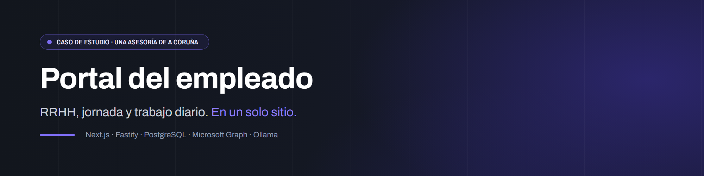
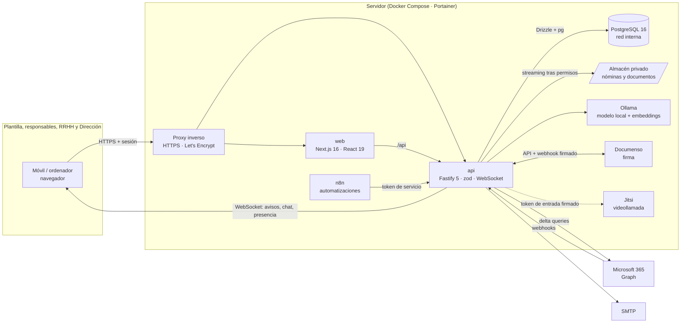

  

# Portal del empleado · RRHH, jornada, documentos y trabajo diario en un solo sitio

         

> [!NOTE]
> **Caso de estudio.** Sistema desarrollado para una asesoría de A Coruña. El código de producción es privado: aquí están el problema, la arquitectura, las decisiones técnicas y [fragmentos de código reescritos](snippets/) para ilustrar las piezas más interesantes.

## El problema

Una asesoría necesita un portal interno para su plantilla que reúna lo que hoy está repartido: fichaje y jornada, vacaciones y ausencias, nóminas y documentos laborales, tareas del día a día, comunicación interna y peticiones a otros departamentos. Con varias condiciones:

- **Datos de RRHH de personas reales**: nóminas, datos bancarios, expediente y registro de jornada. Cada persona tiene que ver solo lo suyo, y RRHH, lo de todos.
- **Obligaciones legales**: el registro de jornada es obligatorio y tiene que reflejar lo que pasó; los documentos laborales tienen plazos de conservación.
- **El correo corporativo sigue en Microsoft 365**, y la firma de documentos y las videollamadas ya funcionaban como servicios aparte.
- **Los datos no salen de la infraestructura de la empresa.**

Hubo un primer intento sobre **Frappe/ERPNext**. Arrastraba muchísima funcionalidad que no se iba a usar y no terminaba de funcionar como se esperaba. La decisión, tomada con Dirección, fue pausarlo y construir un **sistema propio, a medida y por módulos**, aprovechando los flujos que ya se habían validado.

## La solución

Un portal web **mobile-first**, construido **un módulo cada vez** y puesto en producción con la plantilla real desde el primer día:

| Módulo | Qué hace |
|---|---|
| Núcleo y empleados | Acceso con **2FA obligatorio**, roles y permisos, ficha de empleado, departamentos, notificaciones y administración |
| Fichaje y jornada | Fichaje con cronómetro, pausas, horario oficial por persona, horas fuera de horario que autoriza el responsable, bolsa de horas, vacaciones y ausencias con aprobación |
| Nóminas y expediente | RRHH sube las nóminas y cada persona ve solo las suyas, con **acuse de recibo**. Expediente documental y **firma electrónica** dentro del portal |
| Tareas, tiempos y correo | Tablero por departamento, cronómetro, plantillas y recurrencias. El **correo de Microsoft 365** dentro del portal, sincronizado en tiempo real |
| Comunicación interna | Chat de empresa (conversaciones, grupos, canales por departamento, menciones), tablón con acuses y **videollamada** integrada |
| Solicitudes internas | Mesa de ayuda entre departamentos, con plazos que se cuentan en horario laboral |
| Inventario de equipos | Activos, asignaciones a personas, entregas y movimientos |
| Academia y asistente | Formación con cursos y cuestionarios, el manual del portal y un **asistente con IA local** que responde sobre él |

Además: reuniones con reserva de salas, gastos, clientes, estadísticas e informes.

Piezas técnicas destacadas:

- **Permisos centralizados por acción y ámbito.** Cada módulo declara qué puede hacer cada rol y sobre quién: sobre sí mismo, sobre su equipo o sobre todos. Ninguna ruta decide la autorización por su cuenta.
- **Ficheros de personas fuera de la web pública.** Nombres opacos y streaming solo después de comprobar permisos: una URL adivinada no devuelve la nómina de nadie.
- **Auditoría de solo escritura** garantizada por la base de datos, con un trigger.
- **Correo de Microsoft 365 como espejo**, por Microsoft Graph, con webhooks para enterarse al momento y un barrido periódico debajo.
- **Asistente con un modelo local** (Ollama): los datos de la persona los contesta el servidor sin IA, y el manual, con búsqueda semántica y umbrales medidos.
- **Integraciones autoalojadas**: firma con Documenso, videollamada con Jitsi y automatizaciones con n8n a través de una API de servicio con tokens acotados.

## Arquitectura

- **Dos aplicaciones**, `apps/api` y `apps/web`, cada una con su imagen.
- La API separa el **núcleo** (`core/`: permisos, sesiones, cifrado, almacén, auditoría, avisos, cálculo de jornada, correo, asistente y trabajos programados) de las **rutas** (`rutas/`, un fichero por área).
- La base de datos solo es accesible desde la red interna del stack.

Más detalle en [docs/arquitectura.md](docs/arquitectura.md).

## Stack

Las versiones salen de los `package-lock.json` y `Dockerfile` del proyecto.

| Capa | Tecnología | Versión |
|---|---|---|
| Runtime | Node.js | 22 |
| Lenguaje | TypeScript | 5.9 |
| API | Fastify, con `@fastify/websocket`, `@fastify/rate-limit` y `@fastify/cookie` | 5.11 |
| Validación | zod | 3.25 |
| ORM y migraciones | Drizzle ORM / drizzle-kit, con `pg` | 0.45 / 0.31 |
| Base de datos | PostgreSQL, con `pg_stat_statements` | 16 |
| Web | Next.js (App Router, `output: standalone`) | 16.3 |
| UI | React, CSS propio, iconos Phosphor | 19.2 |
| Autenticación | argon2, TOTP (`otplib`) con códigos de recuperación, sesiones opacas | 0.41 / 12.0 |
| Cifrado en reposo | AES-256-GCM (`node:crypto`) | nativo |
| Correo | Microsoft Graph (delta queries y webhooks), nodemailer | — / 9.1 |
| IA local | Ollama: modelo de 7B para redactar y modelo de embeddings para buscar | — |
| Firma y vídeo | Documenso y Jitsi, autoalojados | — |
| Pruebas | Suites E2E en Python, repaso con Chrome sin pantalla, pruebas del motor de cálculo | — |
| Contenedores | Docker Compose gestionado con Portainer, proxy inverso con Let's Encrypt | — |

## Decisiones técnicas

El proyecto lleva un **registro de decisiones** (72 entradas, cada una con su contexto y su porqué). Estas son las más relevantes.

### A medida y por módulos, en vez de un ERP
El intento sobre Frappe/ERPNext traía mucha más funcionalidad de la que se iba a usar y costaba adaptarlo. Un sistema propio permite que **solo entre lo que se usa**, que cada pantalla nazca pensada para el móvil y que las piezas externas que ya funcionan (correo, firma, vídeo, automatización) se integren en lugar de reconstruirse.

Se trabaja **un módulo cada vez**: se especifica al empezarlo, se desarrolla entero, se prueba de punta a punta y no se pasa al siguiente hasta que la plantilla lo usa sin fricción.

### Permisos por acción y ámbito, en un solo sitio
Cada módulo registra sus acciones (`nominas.ver`, `aprobaciones.resolver`…) con un ámbito por rol: `propio`, `equipo`, `todos` o nada. Las rutas solo preguntan, y el ámbito decide qué filas se consultan.

- **Los datos más sensibles tienen su propia acción.** Los datos bancarios y la retribución los ve RRHH, no cualquiera que pueda ver la ficha.
- **«Equipo» se define en un único sitio**: quién depende de quién según los departamentos que lleva cada responsable. Nadie se aprueba a sí mismo lo suyo.
- **Preguntar por una acción que no está registrada es un error**, no un permiso por defecto: una errata en el nombre de un permiso se ve en el momento.

→ [snippets/01-permisos-por-ambito.ts](snippets/01-permisos-por-ambito.ts)

### Los ficheros de personas nunca en la web pública
Nóminas, expediente y adjuntos viven en un volumen montado **solo en la API**, con nombres opacos, y se sirven en streaming **después** de comprobar permisos. Además:

- un PDF se comprueba por su contenido, no por el tipo que declara el navegador;
- «no existe» y «no es tuyo» responden igual, así que no se confirma la existencia de nada;
- la primera vez que el titular abre su nómina queda un **acuse**, y cuando la abre alguien de RRHH queda **auditado**.

→ [snippets/02-almacen-privado.ts](snippets/02-almacen-privado.ts)

### Nada se borra: se retira con motivo
Una nómina o un documento subido a la persona equivocada no se borra, porque tiene un plazo de conservación. Se **retira** con un motivo obligatorio: deja de verlo quien no debe, RRHH conserva el rastro completo y se avisa a la persona solo si llegó a verlo. La misma idea vale para archivar tareas o conversaciones: archivar no es borrar.

### La auditoría es de solo escritura, y lo garantiza la base de datos
Un permiso revocado depende de con qué rol se conecta cada proceso. Un **trigger** se ejecuta siempre, así que la tabla de auditoría rechaza cualquier `UPDATE` o `DELETE`. La única excepción es la limpieza de registros antiguos, que tiene que anunciarse de forma explícita dentro de su propia transacción, y que nunca toca las filas que prueban quién aceptó la política de uso del chat.

→ [snippets/03-auditoria-solo-escritura.sql](snippets/03-auditoria-solo-escritura.sql)

### El registro de jornada guarda lo que pasó; el cómputo decide qué cuenta
Cada fichaje se guarda **a su hora real**, porque el registro tiene que reflejar el inicio y el fin de verdad. Lo que cambia es el cómputo: el motor recorta cada tramo a la **ventana oficial** del día de esa persona y deja dicho cuánto quedó fuera. Ese tiempo **solo suma si el responsable lo autoriza**. La autorización se audita, se avisa a la persona y se puede retirar.

El motor es una función pura (fichajes y configuración del día en la entrada, minutos en la salida), con pruebas sobre la jornada real de la empresa. Los avisos de «fuera de horario» o «no ha fichado» llegan **una sola vez** por persona, día y tipo, a quien le toca resolverlos.

### El correo de Microsoft 365 es un espejo, no un servidor propio
El correo real sigue en Microsoft 365. El portal mantiene una **copia sincronizada con delta queries** (paginada, para buzones con decenas de miles de mensajes), y todo lo que se hace en el portal se escribe en el buzón de verdad.

- **Identificadores inmutables** en todas las peticiones: sin eso, el id de un mensaje cambia al moverlo de carpeta y el espejo se rompe en silencio.
- **Webhooks de Graph** para enterarse al momento, autenticados con un secreto por suscripción, guardado cifrado y comparado en tiempo constante. La notificación no se cree: solo dispara la sincronización.
- **El barrido de 3 minutos no se quita.** Un webhook se puede perder y nadie lo reintenta.
- Siempre se responde **202**: un error hace que Graph reintente el mismo lote hasta retirar la suscripción.

→ [snippets/04-webhook-correo.ts](snippets/04-webhook-correo.ts)

### Un asistente con IA local, y dos cerebros
El asistente usa un **modelo local** (Ollama), así que las preguntas de la plantilla no salen del servidor.

- **Los datos de la persona los contesta el servidor sin IA**: cuántos días de vacaciones le quedan, su jornada o a quién pedir algo salen de una consulta. Ese número lo sabe el portal exacto.
- **Solo el «¿cómo se hace…?» pasa por el modelo**, y la búsqueda la hace el servidor: el modelo recibe los fragmentos del manual ya encontrados y solo redacta.
- **Los umbrales se miden, no se eligen.** Se calibran con preguntas de dentro y de fuera del manual, y se repiten al cambiar el modelo o el contenido. Medido así, el modelo de 7B no se inventaba nada, pero fallaba el 22 % de las preguntas cuya respuesta tenía delante. Para ese falso negativo hay un respaldo: si la búsqueda encontró algo claramente bueno, se enlaza el artículo.

→ [snippets/05-asistente-dos-cerebros.ts](snippets/05-asistente-dos-cerebros.ts)

### Sesiones, 2FA y peticiones
- **2FA obligatorio** con TOTP y códigos de recuperación, y contraseñas con argon2.
- **Sesiones opacas**: la cookie lleva un token aleatorio y en la base solo está su hash. Duran 30 días rodantes, se pueden cerrar en remoto y se renuevan como mucho una vez por hora, para no escribir en cada petición.
- **CSRF por origen**: las peticiones que modifican algo solo se aceptan desde el propio portal. La API de servicio y el webhook de Graph están exentos de forma explícita porque no usan cookies.
- **Límite de peticiones por sesión, no por IP**, porque toda la oficina sale a internet por la misma IP y un límite por IP la bloqueaba entera.
- **Secretos cifrados en reposo** con AES-256-GCM cuando hay que guardarlos en la base de datos.

### Integraciones autoalojadas y acotadas
- **Firma**: Documenso, en el mismo servidor. La firma se ve dentro del portal y sin marca ajena, y el webhook de vuelta se valida con un secreto.
- **Videollamada**: Jitsi, que solo deja entrar con un token que firma el portal. El portal no habla con Jitsi por red: solo firma la entrada.
- **n8n**: entra por una API de servicio con **tokens acotados por departamento**, no con la sesión de una persona.

### Despliegue sin registro
Las imágenes de la API y la web se construyen en el propio servidor, **las dos con la misma etiqueta**, y el stack se redespliega con esa etiqueta desde Portainer. La API aplica las migraciones al arrancar, y la web no arranca hasta que la API pasa su *healthcheck*.

### Pruebas que ven lo que ve una persona
- **Suites E2E por módulo** que recorren flujos completos por HTTP (permisos, aislamiento entre roles, cifrado en reposo, auditoría, correo) y **se limpian solas**. La del módulo de nóminas y expediente tiene 479 comprobaciones.
- **Repaso de navegador automático.** Una suite que habla HTTP no ejecuta JavaScript, y una vez convivió con una sección en blanco. Ahora un script clona la base, levanta la API, la web y un proxy desechables, abre Chrome sin pantalla y recorre todas las rutas: mide desbordes a 390 px, detecta errores pintados en pantalla y recoge los errores de consola.
- **Pruebas del motor de cálculo** con los casos de la jornada real de la empresa.

## Estado actual

- **En producción desde agosto de 2026**, con toda la plantilla.
- **Módulos construidos**: núcleo, fichaje y jornada, nóminas y expediente, tareas y correo, comunicación interna, solicitudes internas, inventario, y academia con el asistente. Además, reuniones y salas, gastos y bolsa de horas.
- El portal sigue creciendo por **rondas de mejoras** que salen del uso diario de la plantilla y de RRHH.
- **Cifras del repositorio**: 206 commits (del 5 de agosto al 28 de septiembre de 2026), 63 migraciones, 147 tablas y unas 75.000 líneas entre la API y la web.

## Cómo se construyó

El portal se desarrolló con **Claude Code** como asistente de programación. La documentación iba primero, el trabajo se hacía un módulo cada vez y había revisión humana antes de dar nada por cerrado.

**Primero, la idea.** Antes de escribir código había un documento de idea con el contexto, los principios del proyecto (solo lo que se usa, un módulo a la vez, móvil siempre, los datos dentro de la empresa), el stack y las decisiones de arranque. Es el documento que el asistente carga para tener el plan completo.

**Cada módulo, especificado al empezar.** Del resto solo había un nombre hasta que llegaba su turno. Entonces se escribía su especificación completa, con los flujos, los permisos y lo que tenía que quedar probado.

**Un registro de decisiones.** 72 entradas, cada una con el contexto, la decisión y el porqué. Muchas nacen de algo que falló o que se midió, y así no se vuelve a discutir lo decidido.

**Rondas de mejoras.** Una vez en producción, el trabajo se organiza en rondas: se recogen las peticiones de la plantilla, RRHH y Dirección, se documentan y se cierran con sus pruebas.

**Nada se cierra sin pruebas.** Un bloque no está hecho hasta que pasan la suite de extremo a extremo y el repaso de navegador. Las decisiones de producto, de permisos o de datos llevan mi aprobación explícita.

**Continuidad entre sesiones.** Un documento de estado recoge dónde está el trabajo, qué hay en producción y qué queda pendiente. Así cualquier sesión nueva retoma sin depender de la memoria de la anterior.

## Lo que he aprendido

- **Un módulo cada vez, con la plantilla real, enseña más que un plan completo.** Especificar cada módulo al empezarlo, con lo aprendido en el anterior, evitó diseñar a ciegas lo que todavía nadie había usado.
- **Las garantías van en la base de datos y se comprueban con pruebas.** Si la promesa depende de que la aplicación «se porte bien», no es una promesa.
- **Integrar es mejor que reconstruir.** El correo, la firma y el vídeo ya funcionaban. El trabajo estaba en integrarlos bien: identificadores estables, webhooks con red debajo y tokens firmados.
- **Con IA, primero lo que no necesita IA.** Un dato exacto se consulta, no se genera. El modelo solo redacta lo que el servidor ya ha encontrado, y los umbrales se miden.
- **Las pruebas por HTTP no ven la pantalla.** Una suite en verde puede convivir con una sección en blanco; por eso el repaso de navegador es automático y no depende de acordarse.
- **Los límites se diseñan para cómo trabaja la gente.** Un límite por IP tiene sentido en abstracto, pero en una oficina que sale por una sola IP bloqueaba a todos a la vez.
