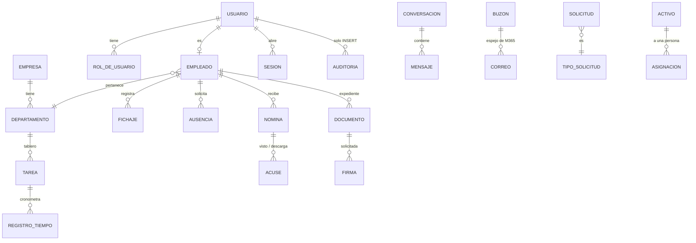

# Arquitectura en detalle

> Caso de estudio. Los nombres de tablas y módulos están simplificados. No hay datos reales.

## 1. Estructura del repositorio

```
portal/
├── apps/
│   ├── api/
│   │   ├── src/
│   │   │   ├── core/        # motor del portal: permisos, sesiones, cifrado, almacén,
│   │   │   │                #   auditoría, avisos, jornada, correo, asistente, trabajos
│   │   │   ├── rutas/       # un fichero por área, registrado con su prefijo
│   │   │   ├── db/          # esquema Drizzle, cliente y migrador
│   │   │   └── server.ts    # plugins, sesión, CSRF, límites y cabeceras
│   │   ├── drizzle/         # migraciones SQL versionadas (0000 → 0062)
│   │   └── Dockerfile
│   └── web/
│       ├── src/
│       │   ├── app/         # App Router: (auth) y (portal)
│       │   └── componentes/ # piezas compartidas, sin librería de UI
│       └── Dockerfile
├── infra/stacks/portal/     # docker-compose versionado del stack
├── pruebas/                 # suites de extremo a extremo, repaso de navegador y escenarios
└── docs/                    # idea, especificación por módulo, decisiones y rondas
```

La API y la web son dos proyectos independientes, cada uno con su `package-lock.json` y su imagen.

## 2. El núcleo (`core/`)

| Pieza | Responsabilidad |
|---|---|
| `permisos` y `guardas` | Registro central de acciones con su ámbito por rol; `exigir()` en cada ruta protegida |
| `equipo` | El único sitio que dice quién depende de quién (departamentos que lleva cada responsable) |
| `sesiones` y `passwords` | Sesiones opacas con hash en la base, renovación rodante, argon2 |
| `crypto` | Cifrado en reposo (AES-256-GCM) de secretos guardados en la base, tokens opacos |
| `almacen` | Ficheros de personas fuera de la web pública, con nombres opacos |
| `auditoria` | Registro de acciones sensibles; nunca tumba la operación si falla |
| `notificar` y `presencia` | Avisos en la campana, por correo y en tiempo real (WebSocket) |
| `jornada-calculo` | Cómputo del día a partir de los fichajes: tramos, pausas, horario oficial, fuera de horario |
| `registro-jornada` | Export del registro de jornada |
| `graph`, `correo-sync`, `correo-webhooks` | Espejo del correo de Microsoft 365 |
| `documenso-cliente` | Firma de documentos con una instancia propia de Documenso |
| `jitsi` | Firma del token de entrada a las videollamadas |
| `academia` y asistente | Formación, manual del portal e índice semántico para el asistente |
| `trabajos` | Pasadas programadas: caducidades, recordatorios, publicaciones programadas, retención |

## 3. Áreas de la API (`rutas/`)

Cada área registra sus rutas con su prefijo (`/api/fichaje`, `/api/nominas`, `/api/tareas`…). Las principales:

- **Personas**: autenticación y 2FA, empleados y departamentos, RRHH, correcciones de datos, administración.
- **Jornada**: fichaje, horarios, ausencias y su gestión, informes.
- **Documentos**: nóminas, expediente, firma.
- **Trabajo**: tareas (tablero, plantillas, recordatorios, tickets), tiempos, clientes, reuniones y salas, gastos.
- **Comunicación**: chat, llamadas, tablón de comunicaciones, notificaciones, WebSocket.
- **Correo**: bandeja, acciones, borradores, categorías y webhook de Graph.
- **Servicio**: solicitudes internas (mesa de ayuda) e inventario de equipos.
- **Conocimiento**: academia, formación, cursos y asistente.
- **Integraciones**: API de servicio para n8n con tokens acotados, y el webhook de Documenso.

## 4. Modelo de datos a alto nivel

147 tablas en 63 migraciones. Por grupos:



| Grupo | Contenido | Notas |
|---|---|---|
| Núcleo | Empresas, departamentos, usuarios, roles, empleados, sesiones, dispositivos de confianza, códigos de recuperación | Los datos sensibles de la ficha tienen su propia acción de permiso |
| Jornada | Jornadas y días, festivos, fichajes, pausas, correcciones, autorizaciones de horas fuera de horario, avisos, ausencias y saldos | El fichaje guarda la hora real; el cómputo decide qué cuenta |
| Documentos | Nóminas y acuses, categorías, documentos del expediente, firmas y eventos de firma | Nada se borra: se retira con motivo |
| Comunicación | Conversaciones, miembros, mensajes, menciones, reacciones, fijados, llamadas, comunicaciones con destinatarios y acuses | Los destinatarios de un comunicado se congelan al publicarlo |
| Trabajo | Tareas, estados, etiquetas, asignados, subtareas, dependencias, comentarios, recurrencias, plantillas, registros de tiempo, reuniones, salas, clientes, gastos | |
| Correo | Buzones, accesos, carpetas, mensajes, firmas, categorías, suscripciones y borradores | Los borradores son del portal, no de Microsoft 365 |
| Servicio | Solicitudes con tipos, campos, estados, mensajes y actividad; inventario de activos con categorías, asignaciones y movimientos | Plazos en horario laboral |
| Conocimiento | Colecciones, temas, piezas, versiones, cursos, lecciones, cuestionarios, asignaciones, progreso y certificados | De la formación se guarda qué y cuándo, nada más |
| Transversal | Notificaciones y preferencias, tokens de servicio, menú, auditoría | La auditoría es de solo escritura |

## 5. Petición a petición

1. **Sesión.** La cookie lleva un token opaco. En la base solo está su hash. Sesión, usuario y ficha se resuelven en una sola consulta, y la caducidad se renueva como mucho una vez por hora.
2. **Límite de peticiones.** El cubo se identifica por la sesión (hash de la cookie) y, sin sesión, por IP.
3. **CSRF.** Las peticiones que modifican algo solo se aceptan desde el propio origen (`Origin` o `Sec-Fetch-Site`). Las únicas excepciones son la API de servicio, que entra con token y sin cookies, y el webhook de Graph, que se autentica con su propio secreto.
4. **Permiso.** Cada ruta llama a `exigir(req, 'modulo.accion')`, y el ámbito decide qué filas se consultan.
5. **Respuesta.** Con `nosniff`, `X-Frame-Options: DENY`, `Referrer-Policy` y, por defecto, `Cache-Control: no-store`.

## 6. Despliegue

- **Tres contenedores** en un stack de Docker Compose gestionado con Portainer: PostgreSQL 16, la API y la web.
- La base de datos vive **solo en la red interna** del stack. La API y la web salen además a la red del proxy inverso, que termina TLS con certificados de Let's Encrypt.
- Las imágenes se construyen en el propio servidor, **las dos con la misma etiqueta**, y el stack se redespliega con esa etiqueta, sin descargar nada de un registro.
- La API aplica sus **migraciones al arrancar**, y los dos contenedores tienen *healthcheck*: la web no arranca hasta que la API responde.
- Los ficheros de personas están en un volumen propio, montado solo en la API.
